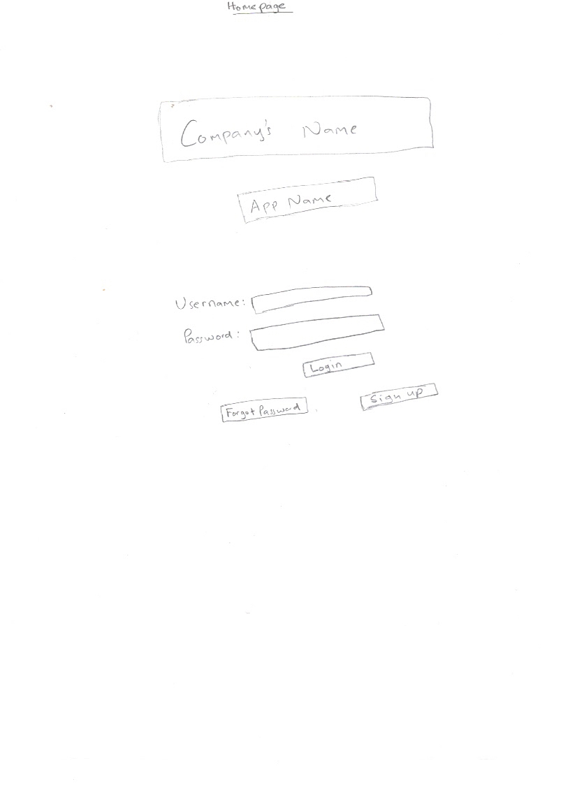
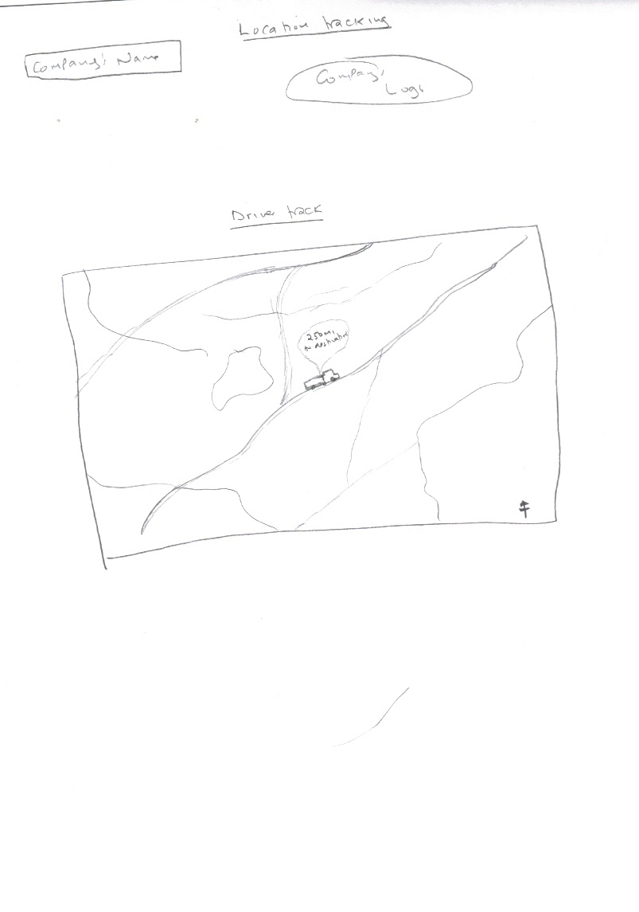

# Project Planning
For this assignment, you'll create some initial plans for your project.

## Assignment Description
[Project Planning Assignment](https://education.launchcode.org/liftoff/modules/assignments/project-planning)

## Submission Instructions

### Wireframes

1. 
2. .png)
3. .png)
4. 
5. 
6. 

### Project Tracker

https://trello.com/b/w3pCVm3i/truck-tracking

### Project Repo Link

https://github.com/kcheruiyot/truck_tracking
